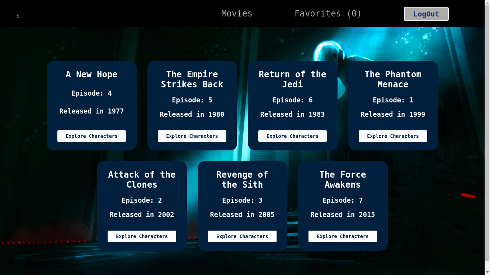
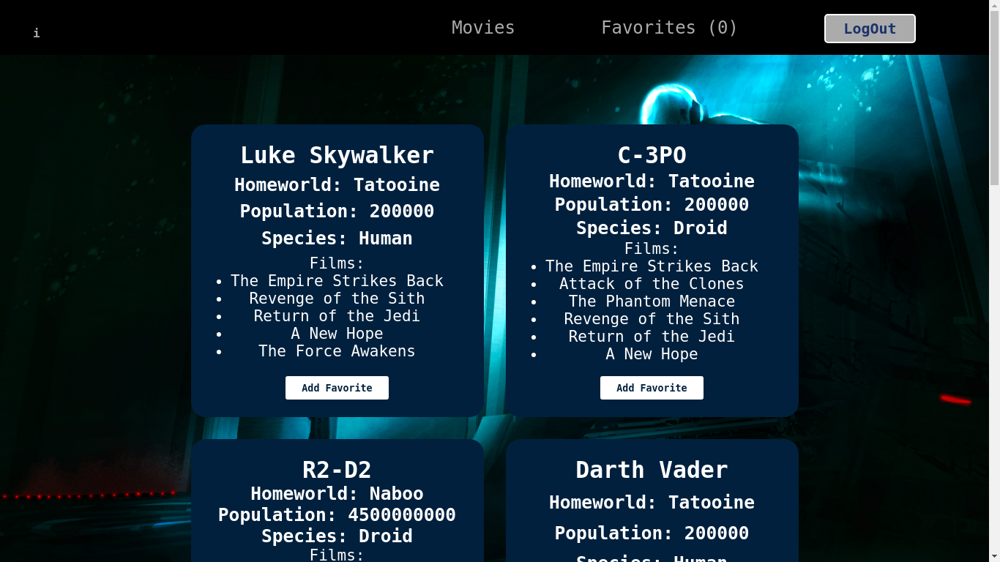

# Welcome to the _Dark Side Force_.

This project is built in React. I utilized the Star Wars API for displaying several nested endpoint in the DOM. React Router allow to redirect user to the different character list pages for wichever Star Wars episode they choose. The user can also "favorites" the character the like, and can choose to display only those characters. But before to do all that the user have to Sign In.

The deployed site can be viewed: **[here](https://dark-force-side.herokuapp.com/)**

## Techniques Stacks
* React / Router

* CSS/Sass

* Jest and Enyzme testing suite

## Screenshot

#### Landing page


#### Movies



#### Characher page



### Set Up

This project was bootstrapped with [Create React App](https://github.com/facebook/create-react-app).

```bash
yarn install
yarn start
```

### Running tests

```bash
yarn test
```
